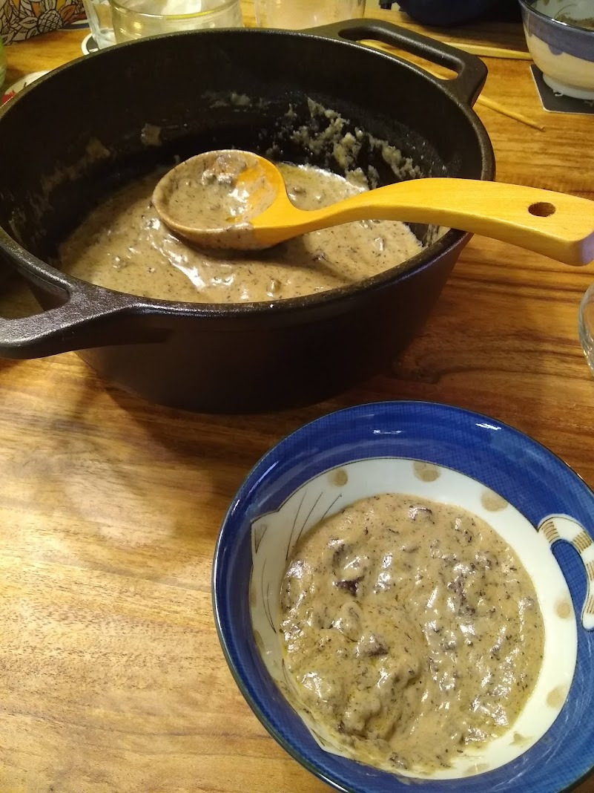

Cream of Mushroom Soup (or Sauce)
==

On the advice of a fellow "Mushroom edibility and discussion" group
member, I made a cream of mushroom soup with this and it turned
out great. The key, besides using butter and a ton of cream, was to
use crushed dried mushroom. The resulting flavor is mushroomy but not
exceedingly so and the texture is firm. My soup was a little thick and
would work better as meat sauce or diluted. The ingredients I used
were roughly:

* 0.5 cup butter
* 0.5 cup flour
* 1.5 cup heavy whipping cream
* 1.5 cup water
* 2 bouillon cubes
* thyme
* 0.5 cup white wine
* 1 cup crushed dried, no-flavor mushrooms

I used other spices too but I couldn't taste them eventually so I'm
not listing them here. Thyme is quite strong and I think works well
with the mushroom.

Cooking instructions: melt the butter, add the flour while stirring,
then add the other fluids and everything else and bring to a boil.

