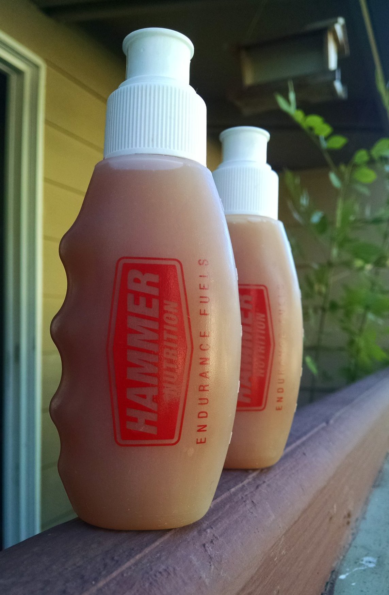

Endurance gel
=============

The composition of this gel is similar to Tailwind.
It is nearly twice as salty as Gatorade,
for a given amount of carbohydrates.

* approximate fructose:glucose ratio: 1:4
* approximate potassium:sodium ratio: 1:3

For 10 servings of 30 mL each corresponding to standard gel packets:

* 150 mL caramel sauce (high-fructose corn syrup with about 40 mg of
  sodium per 15 mL; Ghirardelli or Torani)
* 150 mL light corn syrup (Karo)
* 1500 mg salt (sodium chloride)
* 1500 mg light salt (half sodium chloride, half potassium chloride; Morton)

Required tools:

* measuring cup
* precision scale (AWS-100)
* 5-gel (150mL, 5 fl.oz.) flasks to hold the gels (Hammer)

Preparation:

Pour the liquids into the measuring cup. Weigh the salts, add to the
liquid, mix, pour into the flasks.

Fructose is meant to ease the absorption of glucose but it's very
sweet and the recipe above calls for possibly too much of it.
You may want to reduce the amount of fructose by using less caramel
sauce and more corn syrup instead. For example 100 mL caramel sauce
and 200 mL corn syrup should work well.

A variant of this recipe consists in using honey instead of the
caramel sauce. Honey is half fructose half glucose, roughly like
high-fructose corn syrup and like regular sugar (sucrose),
so you can try to use honey instead of caramel sauce.

